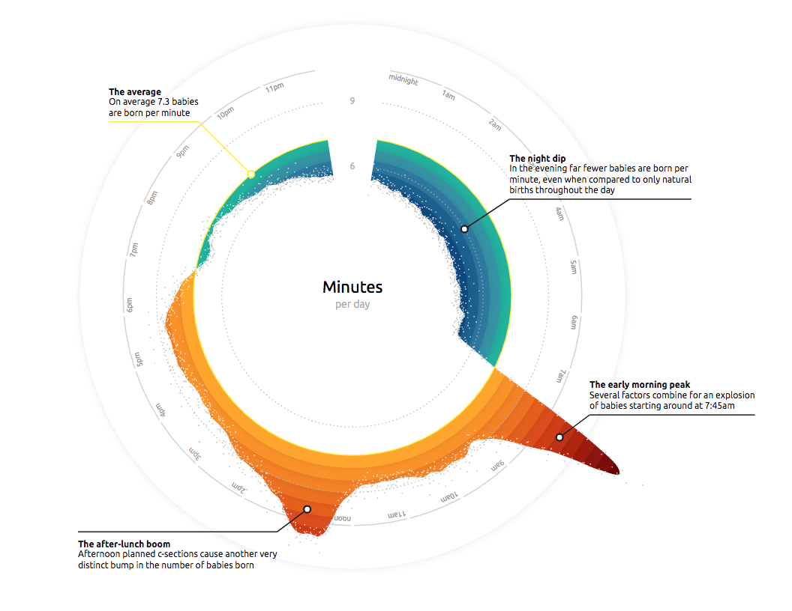

# Baby Spike | Live Coding Talk

Here you can find all of the code, separated out into the different steps, that I go through during my live-coding talk. During this talk I recreate one of the three circular visualizations that is part of the "Baby Spike" visualization that [me](https://twitter.com/nadiehbremer)  and [Zan Armstrong](https://twitter.com/zanstrong) created for the July 2017 issue of the Scientific American.

### Data

Holds the `csv` file with the number of babies born per minute, on average in the US in 2014 *(source: Centers for Disease Control and Prevention)*. The `line` variable in the dataset is a [*loess line*](https://en.wikipedia.org/wiki/Local_regression) I precalculated in R based on the baby data, to use for the red and blue areas in the chart.

### JS

This folder holds the JavaScript for all of the intermediate (& final) steps. You can use `steps.md` to see what each number of the file adds on top of the steps that came before.

### Links

Here are the links that I show during the talk, to explain smaller concepts, such as the *margin convention*, d3's *scales, radial lines* and *areas* or how to place text along an arc. I've numbered them to follow the order in which I go through them during the talk.

### Plugins

To be able to give the talk even without internet, I've downloaded the 2 JavaScript libraries that this talk needs: `d3.v5` & `d3-annotation`. The latter being an extremely useful [d3 plugin](http://d3-annotation.susielu.com/) to create annotations around charts (a *very* and often forgotten thing to do!), created by [Susie Lu](https://twitter.com/datatoviz).

### Links to the final published result
- See the [end result](https://www.visualcinnamon.com/portfolio/baby-spike) as it appeared in the Scientific American magazine
- Read [Zan's blog](https://blogs.scientificamerican.com/sa-visual/why-are-so-many-babies-born-around-8-00-a-m/) on the Scientific American for deeper analysis about the trends in the births of babies
- And here you can find [Zan's](https://medium.com/@zanarmstrong/story-behind-the-viz-the-baby-spike-21d0cd7bc54f) & [my write-up](https://www.visualcinnamon.com/2017/10/creating-baby-births-visual) for those that want to know exactly how we came up with the idea, design and the creation process